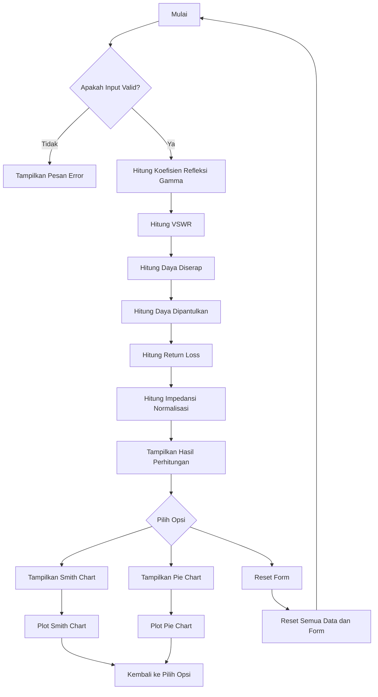

# Pengembangan Kalkulator Analisis VSWR dan Visualisasi Data Berbasis GUI Python


      

### ENGINEERS

- Muhammad Taqi Mufid        (2303421021);
- Rafael Averoez Khan        (2303421012);
- Berta Nauli                (2303421001);
- Riski Isnawati             (2303421020);

### ADVISOR

- Viving Frendiana           (2303421020);

## TUJUAN

Program ini bertujuan untuk menyediakan alat bantu interaktif berbasis GUI yang menghitung dan menganalisis parameter komunikasi RF, seperti koefisien refleksi, VSWR, daya, dan return loss. Dilengkapi dengan visualisasi Smith Chart dan pie chart, program ini mempermudah pengguna dalam memahami karakteristik impedansi dan distribusi daya secara intuitif dan efisien.

## KOMPONEN KALKULASI

Program ini memiliki beberapa komponen kalkulasi utama, yaitu:  

1. **Koefisien Refleksi (Γ)**  
   Menghitung rasio antara impedansi beban (ZL) dan impedansi karakteristik (Z0).  
   $$\[\Gamma = \frac{Z_L - Z_0}{Z_L + Z_0}\]$$

2. **Voltage Standing Wave Ratio (VSWR)**  
   Mengukur rasio gelombang berdiri untuk menentukan efisiensi transmisi daya.  
   $$\[\text{VSWR} = \frac{1 + |\Gamma|}{1 - |\Gamma|}\]$$

3. **Daya yang Diserap (Pabsorbed)**  
   Menghitung persentase daya yang diserap oleh beban berdasarkan nilai (Γ).  
   $$\[P_{\text{absorbed}} = 1 - |\Gamma|^2\]$$

4. **Daya yang Dipantulkan (Preflected)**  
   Menghitung persentase daya yang dipantulkan kembali ke sumber.  
   $$\[P_{\text{reflected}} = |\Gamma|^2\]$$

5. **Return Loss**  
   Mengukur rasio antara daya yang dipantulkan dan daya yang diteruskan dalam dB untuk mengevaluasi kinerja sistem transmisi.  
   $$\[\text{Return Loss} = -20 \log_{10}(|\Gamma|)\]$$

6. **Impedansi Normalisasi ( ZL' )**  
   Menghitung nilai impedansi beban yang dinormalisasi terhadap impedansi karakteristik.  
   $$\[Z_L' = \frac{Z_L}{Z_0}\]$$

Program ini juga menyertakan visualisasi data dengan Smith Chart untuk memetakan (Γ) dan pie chart untuk menunjukkan distribusi daya.

## Install Libraries

```
pip install numpy matplotlib scikit-rf PyQt5
```

## Icon


## FlowChart



## KESIMPULAN

Kesimpulannya, program ini menyediakan solusi yang praktis dan interaktif untuk menghitung, menganalisis, dan memvisualisasikan berbagai parameter penting dalam komunikasi RF, seperti koefisien refleksi, VSWR, daya yang diserap, daya yang dipantulkan, return loss, dan impedansi normalisasi. Dengan integrasi visualisasi menggunakan Smith Chart dan pie chart, program ini mempermudah pemahaman karakteristik sinyal secara intuitif. Alat ini dapat membantu pengguna, baik di lingkungan akademis maupun profesional, untuk meningkatkan efisiensi dan akurasi dalam menganalisis performa sistem transmisi RF.


### End
